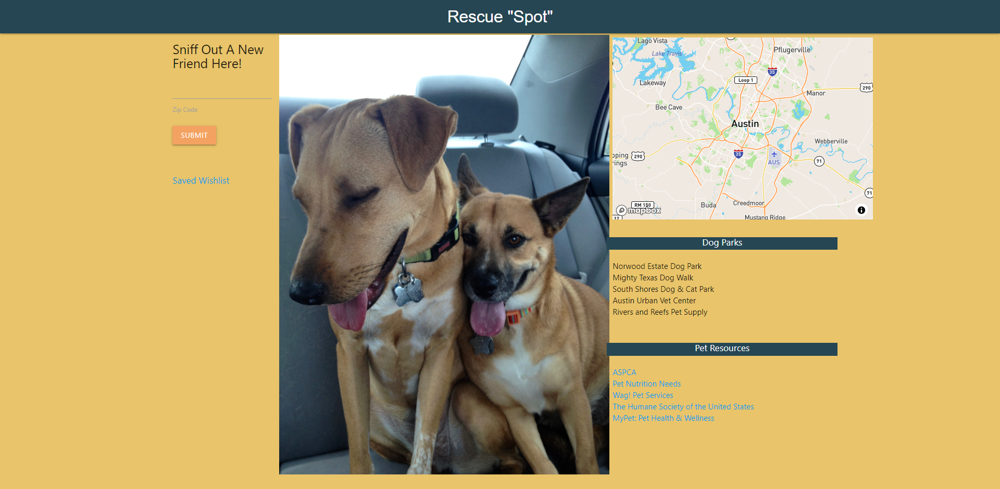
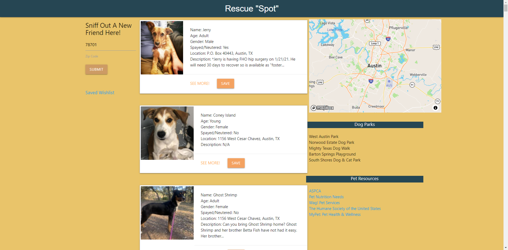

# Rescue-Spot App

Create an app that searches for adoptable dogs in your area and pull in a map with dog parks in your area. App also includes resources for pet owners. 

[View Rescue Spot here](https://dcastelline.github.io/Project-1-Rescue-Spot/)

## Built With 

* HTML
* Materialize
* JavaScript
* Petfinder API
* Mapbox Api

## Contributors

Daniel Castelline
Trevor Smith
Dana Corona
Richard Gabaree

## What we have learned

* Locating API's that would function within the app parameters
* Parsing through the data to filter out what is needed and dynamically making the changes 
* Learning Materialize and how it works with HTML and JavaScript
* Making adjustments as needed to ensure app functionality
* Learning to collaborate with different branches on the same project

# Screenshots

## License Used

MIT License
